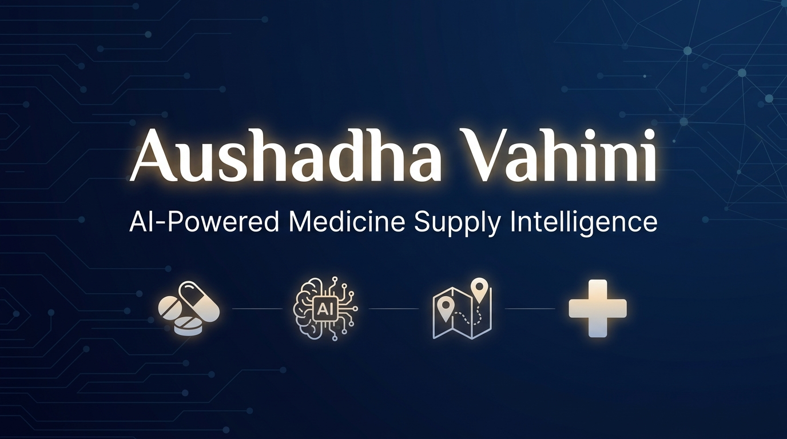
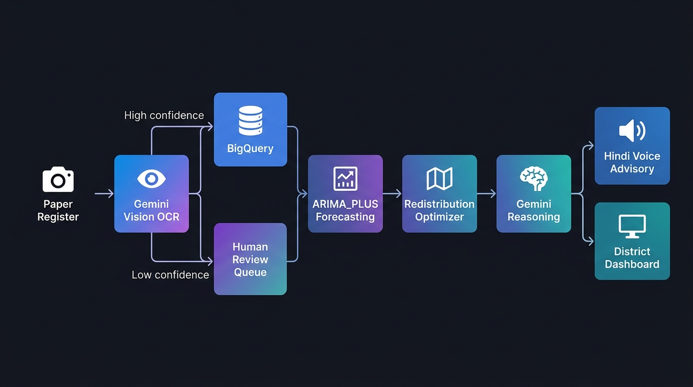
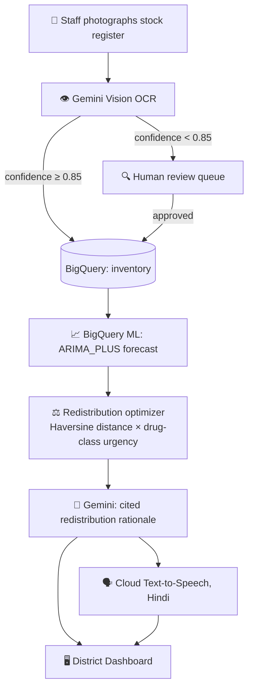

<div align="center">



<br/>

### *आधार से आवश्यकता तक — from surplus to the shelf that's actually empty.*

**Seva · Samarpan · Swasthya**

[](https://cloud.google.com/)
[](https://ai.google.dev/)
[](https://cloud.google.com/bigquery-ml)
[](https://fastapi.tiangolo.com/)
[](https://cloud.google.com/run)
[](https://python.org)

<br/>

**Built for [Build with AI: Code for Communities](https://buildwithai.devpost.com/) — Track 3, Smart Health.**

<br/>

</div>

---

> Somewhere in Adilabad district right now, a Primary Health Centre is one afternoon away from running out of Oxytocin.
> Ten kilometres away, another PHC has a month's surplus of the exact same drug, sitting on a shelf, unknown to anyone but the person who counted it by hand this morning.
>
> **This is not a data problem. It's a distance problem nobody is measuring.**
> Aushadha Vahini measures it — and tells someone, in Hindi, before the shelf goes empty.

---

## 📑 Table of Contents

<details>
<summary>Click to expand</summary>

- [🔴 The Problem](#-the-problem)
- [🟢 The Solution](#-the-solution)
- [🏗️ Architecture](#️-architecture)
- [🧠 Two AI Stages, Not One](#-two-ai-stages-not-one)
- [⚡ Tech Stack](#-tech-stack)
- [📊 Data Sourcing & Transparency](#-data-sourcing--transparency)
- [🚀 Getting Started](#-getting-started)
- [☁️ Deployment](#️-deployment)
- [📂 Project Structure](#-project-structure)
- [⚠️ Known Limitations](#️-known-limitations)
- [👥 Team](#-team)

</details>

---

## 🔴 The Problem

Primary and Community Health Centres across India track medicine stock, patient footfall, bed availability, and doctor attendance largely **on paper**. Nobody is doing anything wrong — this is simply how the system has always worked. But it means:

| Pain Point | Impact |
|:---|:---|
| 💊 **Stock-outs of critical drugs** (insulin, oxytocin, ORS) | Discovered **after** they happen, not before |
| 🔄 **Redistribution between facilities** | Informal, slow, dependent on personal contacts |
| 📋 **No single view of district medicine** | Administrators know where medicine *was*, not where it *is* |

> None of this is a technology failure. It's a **visibility** failure. Aushadha Vahini exists to fix exactly that, without asking a single frontline worker to change how they already do their job.

---

## 🟢 The Solution

```
📸  Photograph the register you already keep
     ↓
👁️  Gemini Vision reads it — uncertain? → human review queue, not a silent guess
     ↓
📈  BigQuery ML forecasts the stock-out 15 days before it happens
     ↓
🧠  Gemini reasons over the forecast + district inventory + distance
     ↓
🗣️  The recommendation is spoken aloud, in Hindi, for staff who'd rather listen
     ↓
🖥️  A district dashboard shows it all, scannable in five seconds
```

> **No new app to learn. No new habit to build.** The paper register staff already keep is the input. Everything downstream is where the intelligence lives.


---


## 🏗️ Architecture

<div align="center">

</div>

<br/>



---

## 🧠 Two AI Stages, Not One

> The single most common failure mode in "AI-powered" civic tech is a rule-based system wearing AI as decoration. Aushadha Vahini deliberately separates **prediction** from **reasoning** — two different kinds of intelligence, doing two different jobs.

<table>
<tr>
<th width="20%"></th>
<th width="40%">📈 Prediction</th>
<th width="40%">🧠 Reasoning</th>
</tr>
<tr>
<td><strong>Engine</strong></td>
<td>BigQuery ML — ARIMA_PLUS</td>
<td>Gemini 2.5 Flash</td>
</tr>
<tr>
<td><strong>Question</strong></td>
<td><em>When</em> will this facility run out?</td>
<td><em>What</em> should happen about it, and <em>why</em>?</td>
</tr>
<tr>
<td><strong>Output</strong></td>
<td>A number, 15 days out, per facility per drug</td>
<td>A cited, plain-language, Hindi directive a human can act on in seconds</td>
</tr>
<tr>
<td><strong>Not Decorative</strong></td>
<td>A genuine per-facility, per-drug time-series model — not <code>if stock &lt; threshold</code></td>
<td>Reasons over forecast + live district inventory + real distance, not a hardcoded template</td>
</tr>
</table>

---

## ⚡ Tech Stack

<div align="center">

| Layer | Technology | Purpose |
|:---:|:---|:---|
| 👁️ | **Gemini 2.5 Flash** (multimodal) | OCR — reads handwritten stock registers |
| 📈 | **BigQuery ML** — ARIMA_PLUS | Time-series forecasting per facility per drug |
| 🧠 | **Gemini 2.5 Flash** (text) | Contextual reasoning over forecasts + inventory |
| 🗣️ | **Cloud Text-to-Speech** (Wavenet, SSML) | Hindi voice advisory for frontline staff |
| 🗄️ | **BigQuery** | Centralized data warehouse |
| ⚙️ | **FastAPI** (Python) | High-performance async backend |
| 🖥️ | **HTML / CSS / JS** | Responsive, bilingual dashboard |
| ☁️ | **Docker → Cloud Run** | Serverless containerized deployment |

</div>

---

## 📊 Data Sourcing & Transparency

> **We believe in radical honesty.**

No public, real-time, facility-level medicine stock feed exists anywhere in India — checked against HMIS (yearly, state-level aggregate only), Rural Health Statistics (district infrastructure and staffing counts, not stock), and the published literature on the gap.

Operational stock and consumption data here is **synthetic** — but **causally modeled**, not random:
- 📊 Footfall drives burn rate
- 👨‍⚕️ Doctor attendance correlates inversely with outbreak load
- 🌧️ One scripted seasonal anomaly is injected on purpose so the forecasting model has something real to catch

> We're stating this plainly because we'd rather you hear it from us than discover it and wonder what else wasn't said. The architecture is built so any district's real inventory system plugs into the same intake path — **the AI core doesn't change**.

---

## 🚀 Getting Started

### Prerequisites

- Python 3.10+
- A Google Cloud project with BigQuery and Gemini API enabled
- (Optional) GCP service account credentials for full functionality

### Installation

```bash
# Clone the repository
git clone https://github.com/MSGitHub127/Aushadha-Vahini.git
cd Aushadha-Vahini

# Install dependencies
pip install -r requirements.txt
```

### Configuration

Copy the example environment file and fill in your credentials:

```bash
cp .env.example .env
```

```env
GOOGLE_CLOUD_PROJECT=your-project-id
GEMINI_API_KEY=your-gemini-key
GOOGLE_APPLICATION_CREDENTIALS=path/to/service-account.json
```

### Run

```bash
# One-time: create schema, seed synthetic data, train forecast model
python db_bq.py

# Start the server
uvicorn main:app --host 0.0.0.0 --port 8080
```

Open **[http://localhost:8080](http://localhost:8080)** and watch the status badge:
- 🟢 **GCP LIVE** — when credentials are active
- 🟡 **FALLBACK MODE** — with an in-memory mock, the app still runs and is honest about which mode it's in

---

## ☁️ Deployment

```bash
# Linux / macOS
./deploy.sh

# Windows PowerShell
./deploy.ps1
```

Deploys to **Cloud Run** in `asia-south1` with a single command.

---

## 📂 Project Structure

```
Aushadha-Vahini/
├── main.py              # FastAPI application — all routes and business logic
├── config.py            # Environment configuration loader
├── gcp_clients.py       # GCP service client initialization
├── db_bq.py             # BigQuery schema, seeder, and ARIMA_PLUS model trainer
├── forecaster.py        # Time-series forecasting engine
├── optimizer.py         # Haversine-weighted redistribution optimizer
├── ocr_digitizer.py     # Gemini Vision OCR pipeline
├── tts_engine.py        # Cloud Text-to-Speech Hindi voice engine
├── requirements.txt     # Python dependencies
├── Dockerfile           # Container build file
├── deploy.sh            # Cloud Run deployment script (Linux)
├── deploy.ps1           # Cloud Run deployment script (Windows)
├── .env.example         # Environment variable template
├── .gitignore           # Git ignore rules
├── static/
│   ├── index.html       # Single-page dashboard (bilingual EN/HI)
│   ├── style.css        # Responsive design system
│   ├── script_v11.js    # Frontend logic, translations, and interactivity
│   ├── logo.png         # Application logo
│   └── uploads/         # OCR upload staging directory
└── docs/
    └── assets/          # README images and diagrams
```

---

## ⚠️ Known Limitations

| Limitation | Detail |
|:---|:---|
| 📊 Synthetic data | Operational data is causally modeled but not from live facilities ([see above](#-data-sourcing--transparency)) |
| ⏱️ Polling-based | Near-real-time polling at 10s intervals, not push-based WebSocket sync |
| 📄 Image-level confidence | Single confidence score per uploaded image, not yet per individual line item |

---

## 👥 Team

<div align="center">

### **Team SuperNovas** 🌟

Built with ❤️ for **Build with AI: Code for Communities** — July 2026

</div>

---

<div align="center">

<br/>

*A shelf doesn't run empty all at once.*
*Someone always knew, ten kilometres away, in time to do something about it.*

**Aushadha Vahini just makes sure that knowledge doesn't stay ten kilometres away.**

<br/>

**Seva · Samarpan · Swasthya**

<br/>

---

<sub>Made in India 🇮🇳 for India's public health infrastructure</sub>

</div>
